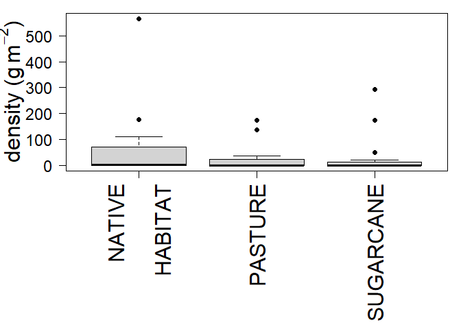
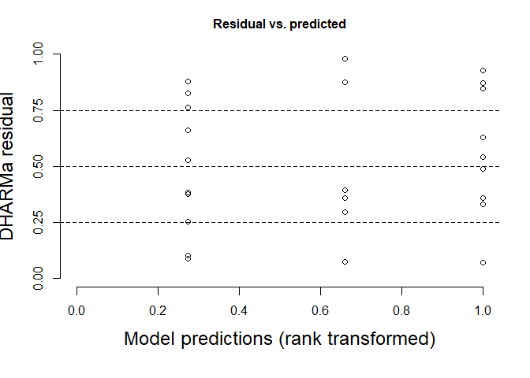
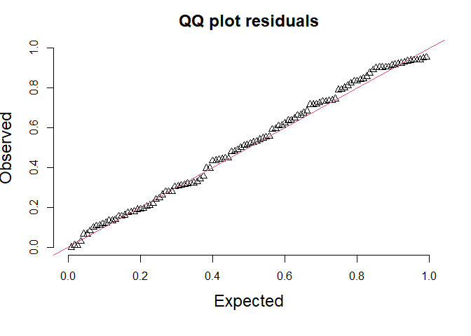
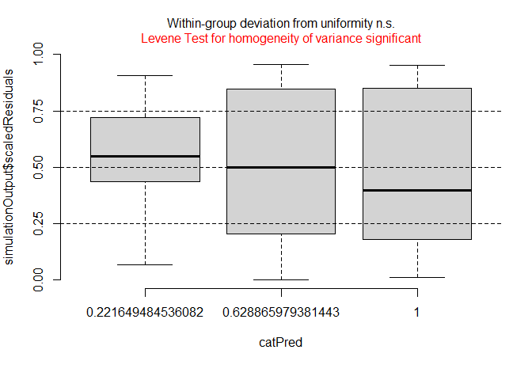
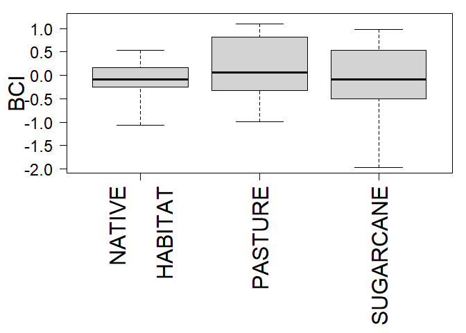

Observational_study
================
Rodolfo Pelinson
2024-09-17

## Occurrence, density, biomass and individual performance analysis of generalist amphibians.

``` r
library(glmmTMB)
library(bbmle)
library(DHARMa)
```

``` r
path <- c("C:/Users/rodol/OneDrive/repos/Detritus_generalist_amphibians/")

biomass <- read.csv(paste(path,"data/biomass.csv", sep = ""))
biomass <- biomass[which(biomass$amostrado == "sim"),]
biomass$land_use <- factor(biomass$land_use, levels = c("cerrado","pastagem","canavial"))


density <- read.csv(paste(path,"data/density.csv", sep = ""))
density <- density[which(density$amostrado == "sim"),]
density$land_use <- factor(density$land_use, levels = c("cerrado","pastagem","canavial"))


occurrence <- read.csv(paste(path,"data/occurrence.csv", sep = ""))
occurrence$land_use <- factor(occurrence$land_use, levels = c("cerrado","pastagem","canavial"))

oc_cerrado <- occurrence[which(occurrence$land_use == "cerrado"),3:8]
oc_pastagem <- occurrence[which(occurrence$land_use == "pastagem"),3:8]
oc_canavial <- occurrence[which(occurrence$land_use == "canavial"),3:8]

freq_cerrado <- apply(oc_cerrado, 2, mean)
freq_pastagem <- apply(oc_pastagem, 2, mean)
freq_canavial <- apply(oc_canavial, 2, mean)

freq <- data.frame(rbind(freq_cerrado,freq_pastagem,freq_canavial))
freq <- freq*100


condicao <- read.csv(paste(path,"data/condicao_corporea.csv", sep = ""), header = T)
condicao <- na.omit(condicao[which(condicao$cauda_danificada == "nao"),])
condicao$estagio <- as.numeric(condicao$estagio)

condicao$uso_da_terra <- factor(condicao$uso_da_terra, levels = c("cerrado","pasto","cana"))
```

This is to add variables combining land uses to the dataframe. Here
“pastagem” means pastures and “canavial” means sugarcane.

``` r
land_use_pastagem_cana <- rep(NA, nrow(biomass))
for(i in 1:nrow(biomass)){
  if(biomass$land_use[i] == "pastagem" | biomass$land_use[i] == "canavial"){
    land_use_pastagem_cana[i] <- "pastagem-canavial"
  }else{land_use_pastagem_cana[i] <- as.character(biomass$land_use[i])}
}

land_use_pastagem_cerrado <- rep(NA, nrow(biomass))
for(i in 1:nrow(biomass)){
  if(biomass$land_use[i] == "pastagem" | biomass$land_use[i] == "cerrado"){
    land_use_pastagem_cerrado[i] <- "pastagem-cerrado"
  }else{land_use_pastagem_cerrado[i] <- as.character(biomass$land_use[i])}
}

land_use_canavial_cerrado <- rep(NA, nrow(biomass))
for(i in 1:nrow(biomass)){
  if(biomass$land_use[i] == "canavial" | biomass$land_use[i] == "cerrado"){
    land_use_canavial_cerrado[i] <- "canavial-cerrado"
  }else{land_use_canavial_cerrado[i] <- as.character(biomass$land_use[i])}
}

biomass <- data.frame(biomass, land_use_pastagem_cana, land_use_pastagem_cerrado,land_use_canavial_cerrado)
density <- data.frame(density, land_use_pastagem_cana, land_use_pastagem_cerrado,land_use_canavial_cerrado)
```

## Biomass

#### D. nanus

``` r
D_nanus_no_effect <- glmmTMB(D_nanus~ 1 + (1|ID), data=biomass, family=tweedie(link = "log"))
D_nanus_land <- glmmTMB(D_nanus~ land_use + (1|ID), data=biomass, family=tweedie(link = "log"))
D_nanus_pastagem_cana_model <- glmmTMB(D_nanus~ land_use_pastagem_cana + (1|ID), data=biomass, family=tweedie(link = "log"))
D_nanus_pastagem_cerrado_model <- glmmTMB(D_nanus~ land_use_pastagem_cerrado + (1|ID), data=biomass, family=tweedie(link = "log"))
D_nanus_canavial_cerrado_model <- glmmTMB(D_nanus~ land_use_canavial_cerrado + (1|ID), data=biomass, family=tweedie(link = "log"))
```

Model Selection

``` r
AICTAB_D_nanus <- AICctab(D_nanus_no_effect, D_nanus_land, D_nanus_pastagem_cana_model,D_nanus_pastagem_cerrado_model,D_nanus_canavial_cerrado_model,weights = T, base = T, logLik = T, sort = F,
                          mnames = c("No Effect", "Savanna # Pasture # Sugarcane", "Savanna # Pasture = Sugarcane", "Savanna = Pasture # Sugarcane", "Savanna = Sugarcane # Pasture" ))

AICTAB_D_nanus
```

    ##                               logLik AICc  dLogLik dAICc df weight
    ## No Effect                     -10.2   29.5   0.0     0.0 4  0.492 
    ## Savanna # Pasture # Sugarcane -10.0   34.3   0.3     4.8 6  0.045 
    ## Savanna # Pasture = Sugarcane -10.2   32.1   0.0     2.6 5  0.137 
    ## Savanna = Pasture # Sugarcane -10.1   31.8   0.1     2.3 5  0.155 
    ## Savanna = Sugarcane # Pasture -10.0   31.6   0.2     2.1 5  0.171

``` r
simulationResiduals_D_nanus <- simulateResiduals(fittedModel = D_nanus_land, plot = F, seed = 3, n = 1000)

par(mar = c(6, 4, 3, 2))

plotQQunif(simulationResiduals_D_nanus, testUniformity = F, testOutliers = F, testDispersion = F, cex.lab = 1.5, cex.main = 1.5) 
```

<!-- -->

``` r
plotResiduals(simulationResiduals_D_nanus,  quantreg = F, cex.lab = 1.5, cex.main = 1.5)
```

<!-- -->

``` r
par(mar = c(12, 05, 1, 1))
boxplot(D_nanus ~ land_use,  data = biomass, xaxt = "n",yaxt = "n", ylab = expression(paste("Biomass (g ", m^-2,")"))
        , xlab = "", cex.lab = 2, cex.axis = 1.1, ygap.axis = 1, pch = 16)
axis(2, las = 2, cex.axis = 1.5)

axis(1, at = c(1,2,3), las = 2, labels = F, )
axis(1, at = c(0.8,2,3), labels = c("NATIVE", "PASTURE", "SUGARCANE"), las = 2, tick = F, cex.axis = 2)
axis(1, at = c(1.2), labels = c("HABITAT"), las = 2, tick = F, cex.axis = 2)
```

<!-- -->

``` r
#text(x = c(1,2,3), y = c(0.4,0.45,0.8), labels = c("a", "a", "a"), cex = 1.5)
```

------------------------------------------------------------------------

#### Scinax

``` r
Scinax_no_effect <- glmmTMB(Scinax~ 1 + (1|ID), data=biomass, family=tweedie(link = "log"))
Scinax_land <- glmmTMB(Scinax~ land_use + (1|ID), data=biomass, family=tweedie(link = "log"))
Scinax_pastagem_cana_model <- glmmTMB(Scinax~ land_use_pastagem_cana + (1|ID), data=biomass, family=tweedie(link = "log"))
Scinax_pastagem_cerrado_model <- glmmTMB(Scinax~ land_use_pastagem_cerrado + (1|ID), data=biomass, family=tweedie(link = "log"))
Scinax_canavial_cerrado_model <- glmmTMB(Scinax~ land_use_canavial_cerrado + (1|ID), data=biomass, family=tweedie(link = "log"))
```

Model Selection

``` r
AICTAB_Scinax <- AICctab(Scinax_no_effect, Scinax_land, Scinax_pastagem_cana_model,Scinax_pastagem_cerrado_model,Scinax_canavial_cerrado_model,weights = T, base = T, logLik = T, sort = F,
                          mnames = c("No Effect", "Savanna # Pasture # Sugarcane", "Savanna # Pasture = Sugarcane", "Savanna = Pasture # Sugarcane", "Savanna = Sugarcane # Pasture" ))

AICTAB_Scinax
```

    ##                               logLik AICc  dLogLik dAICc df weight
    ## No Effect                     -91.1  191.4   0.0     0.0 4  0.496 
    ## Savanna # Pasture # Sugarcane -90.9  196.2   0.3     4.8 6  0.045 
    ## Savanna # Pasture = Sugarcane -91.1  193.9   0.0     2.5 5  0.139 
    ## Savanna = Pasture # Sugarcane -91.1  193.8   0.1     2.5 5  0.146 
    ## Savanna = Sugarcane # Pasture -90.9  193.5   0.2     2.1 5  0.175

``` r
simulationResiduals_Scinax <- simulateResiduals(fittedModel = Scinax_land, plot = F, seed = 3, n = 1000)

par(mar = c(6, 4, 3, 2))

plotQQunif(simulationResiduals_Scinax, testUniformity = F, testOutliers = F, testDispersion = F, cex.lab = 1.5, cex.main = 1.5) 
```

<!-- -->

``` r
plotResiduals(simulationResiduals_Scinax,  quantreg = F, cex.lab = 1.5, cex.main = 1.5)
```

<!-- -->

``` r
par(mar = c(12, 05, 1, 1))
boxplot(Scinax ~ land_use,  data = biomass, xaxt = "n",yaxt = "n", ylab = expression(paste("Biomass (g ", m^-2,")"))
        , xlab = "", cex.lab = 2, cex.axis = 1.1, ygap.axis = 1, pch = 16)
axis(2, las = 2, cex.axis = 1.5)

axis(1, at = c(1,2,3), las = 2, labels = F, )
axis(1, at = c(0.8,2,3), labels = c("NATIVE", "PASTURE", "SUGARCANE"), las = 2, tick = F, cex.axis = 2)
axis(1, at = c(1.2), labels = c("HABITAT"), las = 2, tick = F, cex.axis = 2)
```

<!-- -->

``` r
#text(x = c(1,2,3), y = c(0.4,0.45,0.8), labels = c("a", "a", "a"), cex = 1.5)
```

------------------------------------------------------------------------

#### L. fuscus

``` r
L_fuscus_no_effect <- glmmTMB(L_fuscus~ 1 + (1|ID), data=biomass, family=tweedie(link = "log"))
L_fuscus_land <- glmmTMB(L_fuscus~ land_use + (1|ID), data=biomass, family=tweedie(link = "log"))
L_fuscus_pastagem_cana_model <- glmmTMB(L_fuscus~ land_use_pastagem_cana + (1|ID), data=biomass, family=tweedie(link = "log"))
L_fuscus_pastagem_cerrado_model <- glmmTMB(L_fuscus~ land_use_pastagem_cerrado + (1|ID), data=biomass, family=tweedie(link = "log"))
L_fuscus_canavial_cerrado_model <- glmmTMB(L_fuscus~ land_use_canavial_cerrado + (1|ID), data=biomass, family=tweedie(link = "log"))
```

Model Selection

``` r
AICTAB_L_fuscus <- AICctab(L_fuscus_no_effect, L_fuscus_land, L_fuscus_pastagem_cana_model,L_fuscus_pastagem_cerrado_model,L_fuscus_canavial_cerrado_model,weights = T, base = T, logLik = T, sort = F,
                          mnames = c("No Effect", "Savanna # Pasture # Sugarcane", "Savanna # Pasture = Sugarcane", "Savanna = Pasture # Sugarcane", "Savanna = Sugarcane # Pasture" ))

AICTAB_L_fuscus
```

    ##                               logLik AICc  dLogLik dAICc df weight
    ## No Effect                     -64.8  138.7   0.0     2.6 4  0.14  
    ## Savanna # Pasture # Sugarcane -62.2  138.9   2.6     2.7 6  0.13  
    ## Savanna # Pasture = Sugarcane -63.8  139.3   1.0     3.1 5  0.11  
    ## Savanna = Pasture # Sugarcane -62.2  136.2   2.6     0.0 5  0.53  
    ## Savanna = Sugarcane # Pasture -64.1  139.9   0.7     3.8 5  0.08

``` r
simulationResiduals_L_fuscus <- simulateResiduals(fittedModel = L_fuscus_land, plot = F, seed = 3, n = 1000)

par(mar = c(6, 4, 3, 2))

plotQQunif(simulationResiduals_L_fuscus, testUniformity = F, testOutliers = F, testDispersion = F, cex.lab = 1.5, cex.main = 1.5) 
```

<!-- -->

``` r
plotResiduals(simulationResiduals_L_fuscus,  quantreg = F, cex.lab = 1.5, cex.main = 1.5)
```

<!-- -->

``` r
par(mar = c(12, 05, 1, 1))
boxplot(L_fuscus ~ land_use,  data = biomass, xaxt = "n",yaxt = "n", ylab = expression(paste("Biomass (g ", m^-2,")"))
        , xlab = "", cex.lab = 2, cex.axis = 1.1, ygap.axis = 1, pch = 16)
axis(2, las = 2, cex.axis = 1.5)

axis(1, at = c(1,2,3), las = 2, labels = F, )
axis(1, at = c(0.8,2,3), labels = c("NATIVE", "PASTURE", "SUGARCANE"), las = 2, tick = F, cex.axis = 2)
axis(1, at = c(1.2), labels = c("HABITAT"), las = 2, tick = F, cex.axis = 2)
```

<!-- -->

``` r
#text(x = c(1,2,3), y = c(0.4,0.45,0.8), labels = c("a", "a", "a"), cex = 1.5)
```

------------------------------------------------------------------------

#### P. cuvieri

``` r
P_cuvieri_no_effect <- glmmTMB(P_cuvieri~ 1 + (1|ID), data=biomass, family=tweedie(link = "log"))
P_cuvieri_land <- glmmTMB(P_cuvieri~ land_use + (1|ID), data=biomass, family=tweedie(link = "log"))
P_cuvieri_pastagem_cana_model <- glmmTMB(P_cuvieri~ land_use_pastagem_cana + (1|ID), data=biomass, family=tweedie(link = "log"))
P_cuvieri_pastagem_cerrado_model <- glmmTMB(P_cuvieri~ land_use_pastagem_cerrado + (1|ID), data=biomass, family=tweedie(link = "log"))
P_cuvieri_canavial_cerrado_model <- glmmTMB(P_cuvieri~ land_use_canavial_cerrado + (1|ID), data=biomass, family=tweedie(link = "log"))
```

Model Selection

``` r
AICTAB_P_cuvieri <- AICctab(P_cuvieri_no_effect, P_cuvieri_land, P_cuvieri_pastagem_cana_model,P_cuvieri_pastagem_cerrado_model,P_cuvieri_canavial_cerrado_model,weights = T, base = T, logLik = T, sort = F,
                          mnames = c("No Effect", "Savanna # Pasture # Sugarcane", "Savanna # Pasture = Sugarcane", "Savanna = Pasture # Sugarcane", "Savanna = Sugarcane # Pasture" ))

AICTAB_P_cuvieri
```

    ##                               logLik AICc  dLogLik dAICc df weight
    ## No Effect                     -44.1   97.2   0.0     0.0 4  0.490 
    ## Savanna # Pasture # Sugarcane -43.8  102.0   0.3     4.8 6  0.044 
    ## Savanna # Pasture = Sugarcane -43.8   99.3   0.2     2.1 5  0.171 
    ## Savanna = Pasture # Sugarcane -43.9   99.5   0.2     2.3 5  0.158 
    ## Savanna = Sugarcane # Pasture -44.0   99.8   0.0     2.6 5  0.136

``` r
simulationResiduals_P_cuvieri <- simulateResiduals(fittedModel = P_cuvieri_land, plot = F, seed = 3, n = 1000)

par(mar = c(6, 4, 3, 2))

plotQQunif(simulationResiduals_P_cuvieri, testUniformity = F, testOutliers = F, testDispersion = F, cex.lab = 1.5, cex.main = 1.5) 
```

<!-- -->

``` r
plotResiduals(simulationResiduals_P_cuvieri,  quantreg = F, cex.lab = 1.5, cex.main = 1.5)
```

<!-- -->

``` r
par(mar = c(12, 05, 1, 1))
boxplot(P_cuvieri ~ land_use,  data = biomass, xaxt = "n",yaxt = "n", ylab = expression(paste("Biomass (g ", m^-2,")"))
        , xlab = "", cex.lab = 2, cex.axis = 1.1, ygap.axis = 1, pch = 16)
axis(2, las = 2, cex.axis = 1.5)

axis(1, at = c(1,2,3), las = 2, labels = F, )
axis(1, at = c(0.8,2,3), labels = c("NATIVE", "PASTURE", "SUGARCANE"), las = 2, tick = F, cex.axis = 2)
axis(1, at = c(1.2), labels = c("HABITAT"), las = 2, tick = F, cex.axis = 2)
```

<!-- -->

``` r
#text(x = c(1,2,3), y = c(0.4,0.45,0.8), labels = c("a", "a", "a"), cex = 1.5)
```

------------------------------------------------------------------------

#### P. nattereri

``` r
P_nattereri_no_effect <- glmmTMB(P_nattereri~ 1 + (1|ID), data=biomass, family=tweedie(link = "log"))
P_nattereri_land <- glmmTMB(P_nattereri~ land_use + (1|ID), data=biomass, family=tweedie(link = "log"))
```

    ## Warning in finalizeTMB(TMBStruc, obj, fit, h, data.tmb.old): Model convergence
    ## problem; singular convergence (7). See vignette('troubleshooting'),
    ## help('diagnose')

``` r
P_nattereri_pastagem_cana_model <- glmmTMB(P_nattereri~ land_use_pastagem_cana + (1|ID), data=biomass, family=tweedie(link = "log"))
P_nattereri_pastagem_cerrado_model <- glmmTMB(P_nattereri~ land_use_pastagem_cerrado + (1|ID), data=biomass, family=tweedie(link = "log"))
P_nattereri_canavial_cerrado_model <- glmmTMB(P_nattereri~ land_use_canavial_cerrado + (1|ID), data=biomass, family=tweedie(link = "log"))
```

Model Selection

``` r
AICTAB_P_nattereri <- AICctab(P_nattereri_no_effect, P_nattereri_land, P_nattereri_pastagem_cana_model,P_nattereri_pastagem_cerrado_model,P_nattereri_canavial_cerrado_model,weights = T, base = T, logLik = T, sort = F,
                          mnames = c("No Effect", "Savanna # Pasture # Sugarcane", "Savanna # Pasture = Sugarcane", "Savanna = Pasture # Sugarcane", "Savanna = Sugarcane # Pasture" ))

AICTAB_P_nattereri
```

    ##                               logLik AICc  dLogLik dAICc df weight
    ## No Effect                     -60.7  130.5   0.0     9.5 4  0.0063
    ## Savanna # Pasture # Sugarcane -54.4  123.2   6.3     2.2 6  0.2412
    ## Savanna # Pasture = Sugarcane -54.7  121.0   6.1     0.0 5  0.7399
    ## Savanna = Pasture # Sugarcane -58.9  129.5   1.8     8.5 5  0.0106
    ## Savanna = Sugarcane # Pasture -60.6  132.8   0.1    11.8 5  0.0020

``` r
simulationResiduals_P_nattereri <- simulateResiduals(fittedModel = P_nattereri_land, plot = F, seed = 3, n = 1000)

par(mar = c(6, 4, 3, 2))

plotQQunif(simulationResiduals_P_nattereri, testUniformity = F, testOutliers = F, testDispersion = F, cex.lab = 1.5, cex.main = 1.5) 
```

<!-- -->

``` r
plotResiduals(simulationResiduals_P_nattereri,  quantreg = F, cex.lab = 1.5, cex.main = 1.5)
```

<!-- -->

``` r
par(mar = c(12, 05, 1, 1))
boxplot(P_nattereri ~ land_use,  data = biomass, xaxt = "n",yaxt = "n", ylab = expression(paste("Biomass (g ", m^-2,")"))
        , xlab = "", cex.lab = 2, cex.axis = 1.1, ygap.axis = 1, pch = 16)
axis(2, las = 2, cex.axis = 1.5)

axis(1, at = c(1,2,3), las = 2, labels = F, )
axis(1, at = c(0.8,2,3), labels = c("NATIVE", "PASTURE", "SUGARCANE"), las = 2, tick = F, cex.axis = 2)
axis(1, at = c(1.2), labels = c("HABITAT"), las = 2, tick = F, cex.axis = 2)
```

<!-- -->

``` r
#text(x = c(1,2,3), y = c(0.4,0.45,0.8), labels = c("a", "a", "a"), cex = 1.5)
```

------------------------------------------------------------------------

#### D. minutus

``` r
D_minutus_no_effect <- glmmTMB(D_minutus~ 1 + (1|ID), data=biomass, family=tweedie(link = "log"))
D_minutus_land <- glmmTMB(D_minutus~ land_use + (1|ID), data=biomass, family=tweedie(link = "log"))
D_minutus_pastagem_cana_model <- glmmTMB(D_minutus~ land_use_pastagem_cana + (1|ID), data=biomass, family=tweedie(link = "log"))
D_minutus_pastagem_cerrado_model <- glmmTMB(D_minutus~ land_use_pastagem_cerrado + (1|ID), data=biomass, family=tweedie(link = "log"))
D_minutus_canavial_cerrado_model <- glmmTMB(D_minutus~ land_use_canavial_cerrado + (1|ID), data=biomass, family=tweedie(link = "log"))
```

Model Selection

``` r
AICTAB_D_minutus <- AICctab(D_minutus_no_effect, D_minutus_land, D_minutus_pastagem_cana_model,D_minutus_pastagem_cerrado_model,D_minutus_canavial_cerrado_model,weights = T, base = T, logLik = T, sort = F,
                          mnames = c("No Effect", "Savanna # Pasture # Sugarcane", "Savanna # Pasture = Sugarcane", "Savanna = Pasture # Sugarcane", "Savanna = Sugarcane # Pasture" ))

AICTAB_D_minutus
```

    ##                               logLik AICc  dLogLik dAICc df weight
    ## No Effect                     -37.8   84.8   0.0     2.9 4  0.138 
    ## Savanna # Pasture # Sugarcane -35.0   84.4   2.9     2.5 6  0.169 
    ## Savanna # Pasture = Sugarcane -37.8   87.4   0.0     5.5 5  0.038 
    ## Savanna = Pasture # Sugarcane -37.4   86.5   0.4     4.7 5  0.057 
    ## Savanna = Sugarcane # Pasture -35.1   81.8   2.8     0.0 5  0.599

``` r
simulationResiduals_D_minutus <- simulateResiduals(fittedModel = D_minutus_land, plot = F, seed = 3, n = 1000)

par(mar = c(6, 4, 3, 2))

plotQQunif(simulationResiduals_D_minutus, testUniformity = F, testOutliers = F, testDispersion = F, cex.lab = 1.5, cex.main = 1.5) 
```

<!-- -->

``` r
plotResiduals(simulationResiduals_D_minutus,  quantreg = F, cex.lab = 1.5, cex.main = 1.5)
```

<!-- -->

``` r
par(mar = c(12, 05, 1, 1))
boxplot(D_minutus ~ land_use,  data = biomass, xaxt = "n",yaxt = "n", ylab = expression(paste("Biomass (g ", m^-2,")"))
        , xlab = "", cex.lab = 2, cex.axis = 1.1, ygap.axis = 1, pch = 16)
axis(2, las = 2, cex.axis = 1.5)

axis(1, at = c(1,2,3), las = 2, labels = F, )
axis(1, at = c(0.8,2,3), labels = c("NATIVE", "PASTURE", "SUGARCANE"), las = 2, tick = F, cex.axis = 2)
axis(1, at = c(1.2), labels = c("HABITAT"), las = 2, tick = F, cex.axis = 2)
```

<!-- -->

``` r
#text(x = c(1,2,3), y = c(0.4,0.45,0.8), labels = c("a", "a", "a"), cex = 1.5)
```

         

## Density

#### D. nanus

``` r
D_nanus_no_effect <- glmmTMB(D_nanus~ 1 + (1|ID), data=density, family=tweedie(link = "log"))
D_nanus_land <- glmmTMB(D_nanus~ land_use + (1|ID), data=density, family=tweedie(link = "log"))
D_nanus_pastagem_cana_model <- glmmTMB(D_nanus~ land_use_pastagem_cana + (1|ID), data=density, family=tweedie(link = "log"))
D_nanus_pastagem_cerrado_model <- glmmTMB(D_nanus~ land_use_pastagem_cerrado + (1|ID), data=density, family=tweedie(link = "log"))
D_nanus_canavial_cerrado_model <- glmmTMB(D_nanus~ land_use_canavial_cerrado + (1|ID), data=density, family=tweedie(link = "log"))
```

Model Selection

``` r
AICTAB_D_nanus <- AICctab(D_nanus_no_effect, D_nanus_land, D_nanus_pastagem_cana_model,D_nanus_pastagem_cerrado_model,D_nanus_canavial_cerrado_model,weights = T, base = T, logLik = T, sort = F,
                          mnames = c("No Effect", "Savanna # Pasture # Sugarcane", "Savanna # Pasture = Sugarcane", "Savanna = Pasture # Sugarcane", "Savanna = Sugarcane # Pasture" ))

AICTAB_D_nanus
```

    ##                               logLik AICc  dLogLik dAICc df weight
    ## No Effect                     -41.6   92.3   0.0     0.0 4  0.461 
    ## Savanna # Pasture # Sugarcane -41.1   96.7   0.5     4.3 6  0.053 
    ## Savanna # Pasture = Sugarcane -41.6   94.9   0.0     2.6 5  0.127 
    ## Savanna = Pasture # Sugarcane -41.3   94.3   0.3     1.9 5  0.177 
    ## Savanna = Sugarcane # Pasture -41.3   94.2   0.4     1.8 5  0.183

``` r
simulationResiduals_D_nanus <- simulateResiduals(fittedModel = D_nanus_land, plot = F, seed = 3, n = 1000)

par(mar = c(6, 4, 3, 2))

plotQQunif(simulationResiduals_D_nanus, testUniformity = F, testOutliers = F, testDispersion = F, cex.lab = 1.5, cex.main = 1.5) 
```

<!-- -->

``` r
plotResiduals(simulationResiduals_D_nanus,  quantreg = F, cex.lab = 1.5, cex.main = 1.5)
```

<!-- -->

``` r
par(mar = c(12, 05, 1, 1))
boxplot(D_nanus ~ land_use,  data = density, xaxt = "n",yaxt = "n", ylab = expression(paste("density (g ", m^-2,")"))
        , xlab = "", cex.lab = 2, cex.axis = 1.1, ygap.axis = 1, pch = 16)
axis(2, las = 2, cex.axis = 1.5)

axis(1, at = c(1,2,3), las = 2, labels = F, )
axis(1, at = c(0.8,2,3), labels = c("NATIVE", "PASTURE", "SUGARCANE"), las = 2, tick = F, cex.axis = 2)
axis(1, at = c(1.2), labels = c("HABITAT"), las = 2, tick = F, cex.axis = 2)
```

<!-- -->

``` r
#text(x = c(1,2,3), y = c(0.4,0.45,0.8), labels = c("a", "a", "a"), cex = 1.5)
```

------------------------------------------------------------------------

#### Scinax

``` r
Scinax_no_effect <- glmmTMB(Scinax~ 1 + (1|ID), data=density, family=tweedie(link = "log"))
Scinax_land <- glmmTMB(Scinax~ land_use + (1|ID), data=density, family=tweedie(link = "log"))
Scinax_pastagem_cana_model <- glmmTMB(Scinax~ land_use_pastagem_cana + (1|ID), data=density, family=tweedie(link = "log"))
Scinax_pastagem_cerrado_model <- glmmTMB(Scinax~ land_use_pastagem_cerrado + (1|ID), data=density, family=tweedie(link = "log"))
Scinax_canavial_cerrado_model <- glmmTMB(Scinax~ land_use_canavial_cerrado + (1|ID), data=density, family=tweedie(link = "log"))
```

Model Selection

``` r
AICTAB_Scinax <- AICctab(Scinax_no_effect, Scinax_land, Scinax_pastagem_cana_model,Scinax_pastagem_cerrado_model,Scinax_canavial_cerrado_model,weights = T, base = T, logLik = T, sort = F,
                          mnames = c("No Effect", "Savanna # Pasture # Sugarcane", "Savanna # Pasture = Sugarcane", "Savanna = Pasture # Sugarcane", "Savanna = Sugarcane # Pasture" ))

AICTAB_Scinax
```

    ##                               logLik AICc   dLogLik dAICc  df weight
    ## No Effect                     -133.0  275.1    0.0     0.0 4  0.485 
    ## Savanna # Pasture # Sugarcane -132.7  279.8    0.3     4.7 6  0.046 
    ## Savanna # Pasture = Sugarcane -132.7  277.0    0.3     2.0 5  0.181 
    ## Savanna = Pasture # Sugarcane -132.9  277.5    0.1     2.4 5  0.145 
    ## Savanna = Sugarcane # Pasture -132.9  277.5    0.1     2.4 5  0.143

``` r
simulationResiduals_Scinax <- simulateResiduals(fittedModel = Scinax_land, plot = F, seed = 3, n = 1000)

par(mar = c(6, 4, 3, 2))

plotQQunif(simulationResiduals_Scinax, testUniformity = F, testOutliers = F, testDispersion = F, cex.lab = 1.5, cex.main = 1.5) 
```

<!-- -->

``` r
plotResiduals(simulationResiduals_Scinax,  quantreg = F, cex.lab = 1.5, cex.main = 1.5)
```

<!-- -->

``` r
par(mar = c(12, 05, 1, 1))
boxplot(Scinax ~ land_use,  data = density, xaxt = "n",yaxt = "n", ylab = expression(paste("density (g ", m^-2,")"))
        , xlab = "", cex.lab = 2, cex.axis = 1.1, ygap.axis = 1, pch = 16)
axis(2, las = 2, cex.axis = 1.5)

axis(1, at = c(1,2,3), las = 2, labels = F, )
axis(1, at = c(0.8,2,3), labels = c("NATIVE", "PASTURE", "SUGARCANE"), las = 2, tick = F, cex.axis = 2)
axis(1, at = c(1.2), labels = c("HABITAT"), las = 2, tick = F, cex.axis = 2)
```

<!-- -->

``` r
#text(x = c(1,2,3), y = c(0.4,0.45,0.8), labels = c("a", "a", "a"), cex = 1.5)
```

------------------------------------------------------------------------

#### L. fuscus

``` r
L_fuscus_no_effect <- glmmTMB(L_fuscus~ 1 + (1|ID), data=density, family=tweedie(link = "log"))
L_fuscus_land <- glmmTMB(L_fuscus~ land_use + (1|ID), data=density, family=tweedie(link = "log"))
L_fuscus_pastagem_cana_model <- glmmTMB(L_fuscus~ land_use_pastagem_cana + (1|ID), data=density, family=tweedie(link = "log"))
L_fuscus_pastagem_cerrado_model <- glmmTMB(L_fuscus~ land_use_pastagem_cerrado + (1|ID), data=density, family=tweedie(link = "log"))
L_fuscus_canavial_cerrado_model <- glmmTMB(L_fuscus~ land_use_canavial_cerrado + (1|ID), data=density, family=tweedie(link = "log"))
```

Model Selection

``` r
AICTAB_L_fuscus <- AICctab(L_fuscus_no_effect, L_fuscus_land, L_fuscus_pastagem_cana_model,L_fuscus_pastagem_cerrado_model,L_fuscus_canavial_cerrado_model,weights = T, base = T, logLik = T, sort = F,
                          mnames = c("No Effect", "Savanna # Pasture # Sugarcane", "Savanna # Pasture = Sugarcane", "Savanna = Pasture # Sugarcane", "Savanna = Sugarcane # Pasture" ))

AICTAB_L_fuscus
```

    ##                               logLik AICc  dLogLik dAICc df weight
    ## No Effect                     -79.1  167.3   0.0     2.4 4  0.153 
    ## Savanna # Pasture # Sugarcane -76.6  167.6   2.5     2.6 6  0.137 
    ## Savanna # Pasture = Sugarcane -78.3  168.3   0.8     3.4 5  0.094 
    ## Savanna = Pasture # Sugarcane -76.6  164.9   2.5     0.0 5  0.510 
    ## Savanna = Sugarcane # Pasture -78.2  168.1   0.9     3.1 5  0.106

``` r
simulationResiduals_L_fuscus <- simulateResiduals(fittedModel = L_fuscus_land, plot = F, seed = 3, n = 1000)

par(mar = c(6, 4, 3, 2))

plotQQunif(simulationResiduals_L_fuscus, testUniformity = F, testOutliers = F, testDispersion = F, cex.lab = 1.5, cex.main = 1.5) 
```

<!-- -->

``` r
plotResiduals(simulationResiduals_L_fuscus,  quantreg = F, cex.lab = 1.5, cex.main = 1.5)
```

<!-- -->

``` r
par(mar = c(12, 05, 1, 1))
boxplot(L_fuscus ~ land_use,  data = density, xaxt = "n",yaxt = "n", ylab = expression(paste("density (g ", m^-2,")"))
        , xlab = "", cex.lab = 2, cex.axis = 1.1, ygap.axis = 1, pch = 16)
axis(2, las = 2, cex.axis = 1.5)

axis(1, at = c(1,2,3), las = 2, labels = F, )
axis(1, at = c(0.8,2,3), labels = c("NATIVE", "PASTURE", "SUGARCANE"), las = 2, tick = F, cex.axis = 2)
axis(1, at = c(1.2), labels = c("HABITAT"), las = 2, tick = F, cex.axis = 2)
```

<!-- -->

``` r
#text(x = c(1,2,3), y = c(0.4,0.45,0.8), labels = c("a", "a", "a"), cex = 1.5)
```

------------------------------------------------------------------------

#### P. cuvieri

``` r
P_cuvieri_no_effect <- glmmTMB(P_cuvieri~ 1 + (1|ID), data=density, family=tweedie(link = "log"))
P_cuvieri_land <- glmmTMB(P_cuvieri~ land_use + (1|ID), data=density, family=tweedie(link = "log"))
P_cuvieri_pastagem_cana_model <- glmmTMB(P_cuvieri~ land_use_pastagem_cana + (1|ID), data=density, family=tweedie(link = "log"))
P_cuvieri_pastagem_cerrado_model <- glmmTMB(P_cuvieri~ land_use_pastagem_cerrado + (1|ID), data=density, family=tweedie(link = "log"))
P_cuvieri_canavial_cerrado_model <- glmmTMB(P_cuvieri~ land_use_canavial_cerrado + (1|ID), data=density, family=tweedie(link = "log"))
```

Model Selection

``` r
AICTAB_P_cuvieri <- AICctab(P_cuvieri_no_effect, P_cuvieri_land, P_cuvieri_pastagem_cana_model,P_cuvieri_pastagem_cerrado_model,P_cuvieri_canavial_cerrado_model,weights = T, base = T, logLik = T, sort = F,
                          mnames = c("No Effect", "Savanna # Pasture # Sugarcane", "Savanna # Pasture = Sugarcane", "Savanna = Pasture # Sugarcane", "Savanna = Sugarcane # Pasture" ))

AICTAB_P_cuvieri
```

    ##                               logLik AICc   dLogLik dAICc  df weight
    ## No Effect                     -103.7  216.4    0.0     0.0 4  0.407 
    ## Savanna # Pasture # Sugarcane -102.9  220.1    0.8     3.7 6  0.063 
    ## Savanna # Pasture = Sugarcane -103.0  217.6    0.7     1.2 5  0.222 
    ## Savanna = Pasture # Sugarcane -103.1  217.9    0.6     1.5 5  0.195 
    ## Savanna = Sugarcane # Pasture -103.7  219.0    0.0     2.6 5  0.113

``` r
simulationResiduals_P_cuvieri <- simulateResiduals(fittedModel = P_cuvieri_land, plot = F, seed = 3, n = 1000)

par(mar = c(6, 4, 3, 2))

plotQQunif(simulationResiduals_P_cuvieri, testUniformity = F, testOutliers = F, testDispersion = F, cex.lab = 1.5, cex.main = 1.5) 
```

<!-- -->

``` r
plotResiduals(simulationResiduals_P_cuvieri,  quantreg = F, cex.lab = 1.5, cex.main = 1.5)
```

<!-- -->

``` r
par(mar = c(12, 05, 1, 1))
boxplot(P_cuvieri ~ land_use,  data = density, xaxt = "n",yaxt = "n", ylab = expression(paste("density (g ", m^-2,")"))
        , xlab = "", cex.lab = 2, cex.axis = 1.1, ygap.axis = 1, pch = 16)
axis(2, las = 2, cex.axis = 1.5)

axis(1, at = c(1,2,3), las = 2, labels = F, )
axis(1, at = c(0.8,2,3), labels = c("NATIVE", "PASTURE", "SUGARCANE"), las = 2, tick = F, cex.axis = 2)
axis(1, at = c(1.2), labels = c("HABITAT"), las = 2, tick = F, cex.axis = 2)
```

<!-- -->

``` r
#text(x = c(1,2,3), y = c(0.4,0.45,0.8), labels = c("a", "a", "a"), cex = 1.5)
```

------------------------------------------------------------------------

#### P. nattereri

``` r
P_nattereri_no_effect <- glmmTMB(P_nattereri~ 1 + (1|ID), data=density, family=tweedie(link = "log"))
P_nattereri_land <- glmmTMB(P_nattereri~ land_use + (1|ID), data=density, family=tweedie(link = "log"))
P_nattereri_pastagem_cana_model <- glmmTMB(P_nattereri~ land_use_pastagem_cana + (1|ID), data=density, family=tweedie(link = "log"))
P_nattereri_pastagem_cerrado_model <- glmmTMB(P_nattereri~ land_use_pastagem_cerrado + (1|ID), data=density, family=tweedie(link = "log"))
P_nattereri_canavial_cerrado_model <- glmmTMB(P_nattereri~ land_use_canavial_cerrado + (1|ID), data=density, family=tweedie(link = "log"))
```

Model Selection

``` r
AICTAB_P_nattereri <- AICctab(P_nattereri_no_effect, P_nattereri_land, P_nattereri_pastagem_cana_model,P_nattereri_pastagem_cerrado_model,P_nattereri_canavial_cerrado_model,weights = T, base = T, logLik = T, sort = F,
                          mnames = c("No Effect", "Savanna # Pasture # Sugarcane", "Savanna # Pasture = Sugarcane", "Savanna = Pasture # Sugarcane", "Savanna = Sugarcane # Pasture" ))

AICTAB_P_nattereri
```

    ##                               logLik AICc  dLogLik dAICc df weight
    ## No Effect                     -75.8  160.8   0.0     8.3 4  0.0092
    ## Savanna # Pasture # Sugarcane -69.6  153.6   6.2     1.2 6  0.3263
    ## Savanna # Pasture = Sugarcane -70.4  152.4   5.5     0.0 5  0.5957
    ## Savanna = Pasture # Sugarcane -72.6  156.8   3.3     4.4 5  0.0663
    ## Savanna = Sugarcane # Pasture -75.8  163.3   0.0    10.9 5  0.0025

``` r
simulationResiduals_P_nattereri <- simulateResiduals(fittedModel = P_nattereri_land, plot = F, seed = 3, n = 1000)

par(mar = c(6, 4, 3, 2))

plotQQunif(simulationResiduals_P_nattereri, testUniformity = F, testOutliers = F, testDispersion = F, cex.lab = 1.5, cex.main = 1.5) 
```

<!-- -->

``` r
plotResiduals(simulationResiduals_P_nattereri,  quantreg = F, cex.lab = 1.5, cex.main = 1.5)
```

<!-- -->

``` r
par(mar = c(12, 05, 1, 1))
boxplot(P_nattereri ~ land_use,  data = density, xaxt = "n",yaxt = "n", ylab = expression(paste("density (g ", m^-2,")"))
        , xlab = "", cex.lab = 2, cex.axis = 1.1, ygap.axis = 1, pch = 16)
axis(2, las = 2, cex.axis = 1.5)

axis(1, at = c(1,2,3), las = 2, labels = F, )
axis(1, at = c(0.8,2,3), labels = c("NATIVE", "PASTURE", "SUGARCANE"), las = 2, tick = F, cex.axis = 2)
axis(1, at = c(1.2), labels = c("HABITAT"), las = 2, tick = F, cex.axis = 2)
```

<!-- -->

``` r
#text(x = c(1,2,3), y = c(0.4,0.45,0.8), labels = c("a", "a", "a"), cex = 1.5)
```

------------------------------------------------------------------------

#### D. minutus

``` r
D_minutus_no_effect <- glmmTMB(D_minutus~ 1 + (1|ID), data=density, family=tweedie(link = "log"))
D_minutus_land <- glmmTMB(D_minutus~ land_use + (1|ID), data=density, family=tweedie(link = "log"))
```

    ## Warning in finalizeTMB(TMBStruc, obj, fit, h, data.tmb.old): Model convergence
    ## problem; singular convergence (7). See vignette('troubleshooting'),
    ## help('diagnose')

``` r
D_minutus_pastagem_cana_model <- glmmTMB(D_minutus~ land_use_pastagem_cana + (1|ID), data=density, family=tweedie(link = "log"))
D_minutus_pastagem_cerrado_model <- glmmTMB(D_minutus~ land_use_pastagem_cerrado + (1|ID), data=density, family=tweedie(link = "log"))
D_minutus_canavial_cerrado_model <- glmmTMB(D_minutus~ land_use_canavial_cerrado + (1|ID), data=density, family=tweedie(link = "log"))
```

    ## Warning in finalizeTMB(TMBStruc, obj, fit, h, data.tmb.old): Model convergence
    ## problem; singular convergence (7). See vignette('troubleshooting'),
    ## help('diagnose')

Model Selection

``` r
AICTAB_D_minutus <- AICctab(D_minutus_no_effect, D_minutus_land, D_minutus_pastagem_cana_model,D_minutus_pastagem_cerrado_model,D_minutus_canavial_cerrado_model,weights = T, base = T, logLik = T, sort = F,
                          mnames = c("No Effect", "Savanna # Pasture # Sugarcane", "Savanna # Pasture = Sugarcane", "Savanna = Pasture # Sugarcane", "Savanna = Sugarcane # Pasture" ))

AICTAB_D_minutus
```

    ##                               logLik AICc  dLogLik dAICc df weight
    ## No Effect                     -54.4  117.9   0.0     1.8 4  0.208 
    ## Savanna # Pasture # Sugarcane -52.1  118.6   2.3     2.5 6  0.147 
    ## Savanna # Pasture = Sugarcane -54.1  119.9   0.3     3.7 5  0.079 
    ## Savanna = Pasture # Sugarcane -54.3  120.3   0.1     4.2 5  0.063 
    ## Savanna = Sugarcane # Pasture -52.2  116.1   2.2     0.0 5  0.504

``` r
simulationResiduals_D_minutus <- simulateResiduals(fittedModel = D_minutus_land, plot = F, seed = 3, n = 1000)

par(mar = c(6, 4, 3, 2))

plotQQunif(simulationResiduals_D_minutus, testUniformity = F, testOutliers = F, testDispersion = F, cex.lab = 1.5, cex.main = 1.5) 
```

<!-- -->

``` r
plotResiduals(simulationResiduals_D_minutus,  quantreg = F, cex.lab = 1.5, cex.main = 1.5)
```

<!-- -->

``` r
par(mar = c(12, 05, 1, 1))
boxplot(D_minutus ~ land_use,  data = density, xaxt = "n",yaxt = "n", ylab = expression(paste("density (g ", m^-2,")"))
        , xlab = "", cex.lab = 2, cex.axis = 1.1, ygap.axis = 1, pch = 16)
axis(2, las = 2, cex.axis = 1.5)

axis(1, at = c(1,2,3), las = 2, labels = F, )
axis(1, at = c(0.8,2,3), labels = c("NATIVE", "PASTURE", "SUGARCANE"), las = 2, tick = F, cex.axis = 2)
axis(1, at = c(1.2), labels = c("HABITAT"), las = 2, tick = F, cex.axis = 2)
```

<!-- -->

``` r
#text(x = c(1,2,3), y = c(0.4,0.45,0.8), labels = c("a", "a", "a"), cex = 1.5)
```

         

## Occurrence

#### D. nanus

``` r
D_nanus_no_effect <- glmmTMB(D_nanus~ 1 , data=occurrence, family="binomial")
D_nanus_land <- glmmTMB(D_nanus~ land_use , data=occurrence, family="binomial")
D_nanus_pastagem_cana_model <- glmmTMB(D_nanus~ land_use_pastagem_cana , data=occurrence, family="binomial")
D_nanus_pastagem_cerrado_model <- glmmTMB(D_nanus~ land_use_pastagem_cerrado , data=occurrence, family="binomial")
D_nanus_canavial_cerrado_model <- glmmTMB(D_nanus~ land_use_canavial_cerrado , data=occurrence, family="binomial")
```

Model Selection

``` r
AICTAB_D_nanus <- AICctab(D_nanus_no_effect, D_nanus_land, D_nanus_pastagem_cana_model,D_nanus_pastagem_cerrado_model,D_nanus_canavial_cerrado_model,weights = T, base = T, logLik = T, sort = F,
                          mnames = c("No Effect", "Savanna # Pasture # Sugarcane", "Savanna # Pasture = Sugarcane", "Savanna = Pasture # Sugarcane", "Savanna = Sugarcane # Pasture" ))

AICTAB_D_nanus
```

    ##                               logLik AICc  dLogLik dAICc df weight
    ## No Effect                     -17.7   37.6   0.0     0.0 1  0.355 
    ## Savanna # Pasture # Sugarcane -16.8   40.7   0.9     3.1 3  0.076 
    ## Savanna # Pasture = Sugarcane -17.2   39.0   0.5     1.4 2  0.179 
    ## Savanna = Pasture # Sugarcane -16.8   38.1   0.9     0.5 2  0.270 
    ## Savanna = Sugarcane # Pasture -17.6   39.8   0.1     2.2 2  0.120

``` r
simulationResiduals_D_nanus <- simulateResiduals(fittedModel = D_nanus_land, plot = F, seed = 3, n = 1000)

par(mar = c(6, 4, 3, 2))

plotQQunif(simulationResiduals_D_nanus, testUniformity = F, testOutliers = F, testDispersion = F, cex.lab = 1.5, cex.main = 1.5) 
```

<!-- -->

``` r
plotResiduals(simulationResiduals_D_nanus,  quantreg = F, cex.lab = 1.5, cex.main = 1.5)
```

<!-- -->

``` r
par(mar = c(9, 05, 1, 1))

barplot(freq$D_nanus, xaxt = "n", yaxt = "n", ylab = expression(paste("Frequency (%)"))
        , xlab = "", cex.lab = 2, cex.axis = 1.1, ylim = c(0,110), xlim = c(0,4.2), width = 1, space = c(0.3,0.3,0.3), xaxs = "i") #space are fractions of width
axis(2, las = 2, cex.axis = 1.5)
axis(1, at = c(0.3+0.3, (0.3*2)+1+0.5  , (0.3*3)+2+0.5), labels = c("NATIVE", "PASTURE", "SUGARCANE"), las = 2, tick = F, cex.axis = 1.5)
axis(1, at = c(0.7+0.3), labels = c("HABITAT"), las = 2, tick = F, cex.axis = 1.5)
#text(x = c(0.45,1.5,2.475), y = c(105,105,105), labels = c("a", "a", "a"), cex = 1.5)
box()
```

<!-- -->

------------------------------------------------------------------------

#### Scinax

``` r
Scinax_no_effect <- glmmTMB(Scinax~ 1, data=occurrence, family="binomial")
Scinax_land <- glmmTMB(Scinax~ land_use , data=occurrence, family="binomial")
Scinax_pastagem_cana_model <- glmmTMB(Scinax~ land_use_pastagem_cana, data=occurrence, family="binomial")
Scinax_pastagem_cerrado_model <- glmmTMB(Scinax~ land_use_pastagem_cerrado, data=occurrence, family="binomial")
Scinax_canavial_cerrado_model <- glmmTMB(Scinax~ land_use_canavial_cerrado, data=occurrence, family="binomial")
```

Model Selection

``` r
AICTAB_Scinax <- AICctab(Scinax_no_effect, Scinax_land, Scinax_pastagem_cana_model,Scinax_pastagem_cerrado_model,Scinax_canavial_cerrado_model,weights = T, base = T, logLik = T, sort = F,
                          mnames = c("No Effect", "Savanna # Pasture # Sugarcane", "Savanna # Pasture = Sugarcane", "Savanna = Pasture # Sugarcane", "Savanna = Sugarcane # Pasture" ))

AICTAB_Scinax
```

    ##                               logLik AICc  dLogLik dAICc df weight
    ## No Effect                     -17.3   36.8   0.0     0.0 1  0.317 
    ## Savanna # Pasture # Sugarcane -16.2   39.4   1.2     2.6 3  0.086 
    ## Savanna # Pasture = Sugarcane -16.5   37.6   0.8     0.8 2  0.218 
    ## Savanna = Pasture # Sugarcane -16.3   37.1   1.0     0.3 2  0.278 
    ## Savanna = Sugarcane # Pasture -17.3   39.1   0.0     2.3 2  0.102

``` r
simulationResiduals_Scinax <- simulateResiduals(fittedModel = Scinax_land, plot = F, seed = 3, n = 1000)

par(mar = c(6, 4, 3, 2))

plotQQunif(simulationResiduals_Scinax, testUniformity = F, testOutliers = F, testDispersion = F, cex.lab = 1.5, cex.main = 1.5) 
```

<!-- -->

``` r
plotResiduals(simulationResiduals_Scinax,  quantreg = F, cex.lab = 1.5, cex.main = 1.5)
```

<!-- -->

``` r
par(mar = c(9, 05, 1, 1))

barplot(freq$Scinax, xaxt = "n", yaxt = "n", ylab = expression(paste("Frequency (%)"))
        , xlab = "", cex.lab = 2, cex.axis = 1.1, ylim = c(0,110), xlim = c(0,4.2), width = 1, space = c(0.3,0.3,0.3), xaxs = "i") #space are fractions of width
axis(2, las = 2, cex.axis = 1.5)
axis(1, at = c(0.3+0.3, (0.3*2)+1+0.5  , (0.3*3)+2+0.5), labels = c("NATIVE", "PASTURE", "SUGARCANE"), las = 2, tick = F, cex.axis = 1.5)
axis(1, at = c(0.7+0.3), labels = c("HABITAT"), las = 2, tick = F, cex.axis = 1.5)
#text(x = c(0.45,1.5,2.475), y = c(105,105,105), labels = c("a", "a", "a"), cex = 1.5)
box()
```

<!-- -->

------------------------------------------------------------------------

#### L. fuscus

``` r
L_fuscus_no_effect <- glmmTMB(L_fuscus~ 1 , data=occurrence, family="binomial")
L_fuscus_land <- glmmTMB(L_fuscus~ land_use , data=occurrence, family="binomial")
L_fuscus_pastagem_cana_model <- glmmTMB(L_fuscus~ land_use_pastagem_cana , data=occurrence, family="binomial")
L_fuscus_pastagem_cerrado_model <- glmmTMB(L_fuscus~ land_use_pastagem_cerrado , data=occurrence, family="binomial")
L_fuscus_canavial_cerrado_model <- glmmTMB(L_fuscus~ land_use_canavial_cerrado , data=occurrence, family="binomial")
```

Model Selection

``` r
AICTAB_L_fuscus <- AICctab(L_fuscus_no_effect, L_fuscus_land, L_fuscus_pastagem_cana_model,L_fuscus_pastagem_cerrado_model,L_fuscus_canavial_cerrado_model,weights = T, base = T, logLik = T, sort = F,
                          mnames = c("No Effect", "Savanna # Pasture # Sugarcane", "Savanna # Pasture = Sugarcane", "Savanna = Pasture # Sugarcane", "Savanna = Sugarcane # Pasture" ))

AICTAB_L_fuscus
```

    ##                               logLik AICc  dLogLik dAICc df weight
    ## No Effect                     -12.7   27.6   0.0     4.0 1  0.086 
    ## Savanna # Pasture # Sugarcane  -9.5   26.2   3.2     2.6 3  0.176 
    ## Savanna # Pasture = Sugarcane -11.9   28.3   0.8     4.7 2  0.061 
    ## Savanna = Pasture # Sugarcane  -9.5   23.6   3.2     0.0 2  0.635 
    ## Savanna = Sugarcane # Pasture -12.3   29.1   0.5     5.5 2  0.042

``` r
simulationResiduals_L_fuscus <- simulateResiduals(fittedModel = L_fuscus_land, plot = F, seed = 3, n = 1000)

par(mar = c(6, 4, 3, 2))

plotQQunif(simulationResiduals_L_fuscus, testUniformity = F, testOutliers = F, testDispersion = F, cex.lab = 1.5, cex.main = 1.5) 
```

<!-- -->

``` r
plotResiduals(simulationResiduals_L_fuscus,  quantreg = F, cex.lab = 1.5, cex.main = 1.5)
```

<!-- -->

``` r
par(mar = c(9, 05, 1, 1))

barplot(freq$L_fuscus, xaxt = "n", yaxt = "n", ylab = expression(paste("Frequency (%)"))
        , xlab = "", cex.lab = 2, cex.axis = 1.1, ylim = c(0,110), xlim = c(0,4.2), width = 1, space = c(0.3,0.3,0.3), xaxs = "i") #space are fractions of width
axis(2, las = 2, cex.axis = 1.5)
axis(1, at = c(0.3+0.3, (0.3*2)+1+0.5  , (0.3*3)+2+0.5), labels = c("NATIVE", "PASTURE", "SUGARCANE"), las = 2, tick = F, cex.axis = 1.5)
axis(1, at = c(0.7+0.3), labels = c("HABITAT"), las = 2, tick = F, cex.axis = 1.5)
#text(x = c(0.5+0.3,(0.3*2)+1+0.5,(0.3*3)+2+0.5), y = c(105,105,105), labels = c("a", "a", "b"), cex = 1.5)
box()
```

<!-- -->

------------------------------------------------------------------------

#### P. cuvieri

``` r
P_cuvieri_no_effect <- glmmTMB(P_cuvieri~ 1 , data=occurrence, family="binomial")
P_cuvieri_land <- glmmTMB(P_cuvieri~ land_use , data=occurrence, family="binomial")
P_cuvieri_pastagem_cana_model <- glmmTMB(P_cuvieri~ land_use_pastagem_cana , data=occurrence, family="binomial")
P_cuvieri_pastagem_cerrado_model <- glmmTMB(P_cuvieri~ land_use_pastagem_cerrado , data=occurrence, family="binomial")
P_cuvieri_canavial_cerrado_model <- glmmTMB(P_cuvieri~ land_use_canavial_cerrado , data=occurrence, family="binomial")
```

Model Selection

``` r
AICTAB_P_cuvieri <- AICctab(P_cuvieri_no_effect, P_cuvieri_land, P_cuvieri_pastagem_cana_model,P_cuvieri_pastagem_cerrado_model,P_cuvieri_canavial_cerrado_model,weights = T, base = T, logLik = T, sort = F,
                          mnames = c("No Effect", "Savanna # Pasture # Sugarcane", "Savanna # Pasture = Sugarcane", "Savanna = Pasture # Sugarcane", "Savanna = Sugarcane # Pasture" ))

AICTAB_P_cuvieri
```

    ##                               logLik AICc  dLogLik dAICc df weight
    ## No Effect                     -15.1   32.5   0.0     1.0 1  0.232 
    ## Savanna # Pasture # Sugarcane -13.4   33.9   1.7     2.5 3  0.111 
    ## Savanna # Pasture = Sugarcane -14.2   32.9   1.0     1.4 2  0.188 
    ## Savanna = Pasture # Sugarcane -13.5   31.5   1.7     0.0 2  0.381 
    ## Savanna = Sugarcane # Pasture -14.9   34.4   0.2     2.9 2  0.089

``` r
simulationResiduals_P_cuvieri <- simulateResiduals(fittedModel = P_cuvieri_land, plot = F, seed = 3, n = 1000)

par(mar = c(6, 4, 3, 2))

plotQQunif(simulationResiduals_P_cuvieri, testUniformity = F, testOutliers = F, testDispersion = F, cex.lab = 1.5, cex.main = 1.5) 
```

<!-- -->

``` r
plotResiduals(simulationResiduals_P_cuvieri,  quantreg = F, cex.lab = 1.5, cex.main = 1.5)
```

<!-- -->

``` r
par(mar = c(12, 05, 1, 1))
barplot(freq$P_cuvieri, xaxt = "n", yaxt = "n", ylab = expression(paste("Frequency (%)"))
        , xlab = "", cex.lab = 2, cex.axis = 1.1, ylim = c(0,110), xlim = c(0,4.2), width = 1, space = c(0.3,0.3,0.3), xaxs = "i") #space are fractions of width
axis(2, las = 2, cex.axis = 1.5)
axis(1, at = c(0.3+0.3, (0.3*2)+1+0.5  , (0.3*3)+2+0.5), labels = c("NATIVE", "PASTURE", "SUGARCANE"), las = 2, tick = F, cex.axis = 1.5)
axis(1, at = c(0.7+0.3), labels = c("HABITAT"), las = 2, tick = F, cex.axis = 1.5)
#text(x = c(0.45,1.5,2.475), y = c(105,105,105), labels = c("a", "a", "a"), cex = 1.5)
box()
```

<!-- -->

------------------------------------------------------------------------

#### P. nattereri

``` r
P_nattereri_no_effect <- glmmTMB(P_nattereri~ 1 , data=occurrence, family="binomial")
P_nattereri_land <- glmmTMB(P_nattereri~ land_use , data=occurrence, family="binomial")
P_nattereri_pastagem_cana_model <- glmmTMB(P_nattereri~ land_use_pastagem_cana , data=occurrence, family="binomial")
P_nattereri_pastagem_cerrado_model <- glmmTMB(P_nattereri~ land_use_pastagem_cerrado , data=occurrence, family="binomial")
P_nattereri_canavial_cerrado_model <- glmmTMB(P_nattereri~ land_use_canavial_cerrado , data=occurrence, family="binomial")
```

Model Selection

``` r
AICTAB_P_nattereri <- AICctab(P_nattereri_no_effect, P_nattereri_land, P_nattereri_pastagem_cana_model,P_nattereri_pastagem_cerrado_model,P_nattereri_canavial_cerrado_model,weights = T, base = T, logLik = T, sort = F,
                          mnames = c("No Effect", "Savanna # Pasture # Sugarcane", "Savanna # Pasture = Sugarcane", "Savanna = Pasture # Sugarcane", "Savanna = Sugarcane # Pasture" ))

AICTAB_P_nattereri
```

    ##                               logLik AICc  dLogLik dAICc df weight
    ## No Effect                     -17.9   38.1   0.0     1.0 1  0.224 
    ## Savanna # Pasture # Sugarcane -16.1   39.4   1.8     2.3 3  0.116 
    ## Savanna # Pasture = Sugarcane -16.3   37.1   1.7     0.0 2  0.363 
    ## Savanna = Pasture # Sugarcane -16.8   38.0   1.2     0.9 2  0.226 
    ## Savanna = Sugarcane # Pasture -17.9   40.4   0.0     3.3 2  0.071

``` r
simulationResiduals_P_nattereri <- simulateResiduals(fittedModel = P_nattereri_land, plot = F, seed = 3, n = 1000)

par(mar = c(6, 4, 3, 2))

plotQQunif(simulationResiduals_P_nattereri, testUniformity = F, testOutliers = F, testDispersion = F, cex.lab = 1.5, cex.main = 1.5) 
```

<!-- -->

``` r
plotResiduals(simulationResiduals_P_nattereri,  quantreg = F, cex.lab = 1.5, cex.main = 1.5)
```

<!-- -->

``` r
par(mar = c(12, 05, 1, 1))
par(mar = c(9, 05, 1, 1))

barplot(freq$P_nattereri, xaxt = "n", yaxt = "n", ylab = expression(paste("Frequency (%)"))
        , xlab = "", cex.lab = 2, cex.axis = 1.1, ylim = c(0,110), xlim = c(0,4.2), width = 1, space = c(0.3,0.3,0.3), xaxs = "i") #space are fractions of width
axis(2, las = 2, cex.axis = 1.5)
axis(1, at = c(0.3+0.3, (0.3*2)+1+0.5  , (0.3*3)+2+0.5), labels = c("NATIVE", "PASTURE", "SUGARCANE"), las = 2, tick = F, cex.axis = 1.5)
axis(1, at = c(0.7+0.3), labels = c("HABITAT"), las = 2, tick = F, cex.axis = 1.5)
#text(x = c(0.45,1.5,2.475), y = c(105,105,105), labels = c("a", "a", "a"), cex = 1.5)
box()
```

<!-- -->

------------------------------------------------------------------------

#### D. minutus

``` r
D_minutus_no_effect <- glmmTMB(D_minutus~ 1 , data=occurrence, family="binomial")
D_minutus_land <- glmmTMB(D_minutus~ land_use , data=occurrence, family="binomial")
D_minutus_pastagem_cana_model <- glmmTMB(D_minutus~ land_use_pastagem_cana , data=occurrence, family="binomial")
D_minutus_pastagem_cerrado_model <- glmmTMB(D_minutus~ land_use_pastagem_cerrado , data=occurrence, family="binomial")
D_minutus_canavial_cerrado_model <- glmmTMB(D_minutus~ land_use_canavial_cerrado , data=occurrence, family="binomial")
```

Model Selection

``` r
AICTAB_D_minutus <- AICctab(D_minutus_no_effect, D_minutus_land, D_minutus_pastagem_cana_model,D_minutus_pastagem_cerrado_model,D_minutus_canavial_cerrado_model,weights = T, base = T, logLik = T, sort = F,
                          mnames = c("No Effect", "Savanna # Pasture # Sugarcane", "Savanna # Pasture = Sugarcane", "Savanna = Pasture # Sugarcane", "Savanna = Sugarcane # Pasture" ))

AICTAB_D_minutus
```

    ##                               logLik AICc  dLogLik dAICc df weight
    ## No Effect                     -17.9   38.1   0.0     0.0 1  0.426 
    ## Savanna # Pasture # Sugarcane -17.5   42.0   0.5     4.0 3  0.059 
    ## Savanna # Pasture = Sugarcane -17.5   39.5   0.5     1.4 2  0.208 
    ## Savanna = Pasture # Sugarcane -17.7   39.9   0.3     1.8 2  0.172 
    ## Savanna = Sugarcane # Pasture -17.9   40.4   0.0     2.3 2  0.134

``` r
simulationResiduals_D_minutus <- simulateResiduals(fittedModel = D_minutus_land, plot = F, seed = 3, n = 1000)

par(mar = c(6, 4, 3, 2))

plotQQunif(simulationResiduals_D_minutus, testUniformity = F, testOutliers = F, testDispersion = F, cex.lab = 1.5, cex.main = 1.5) 
```

<!-- -->

``` r
plotResiduals(simulationResiduals_D_minutus,  quantreg = F, cex.lab = 1.5, cex.main = 1.5)
```

<!-- -->

``` r
par(mar = c(9, 05, 1, 1))

barplot(freq$D_minutus, xaxt = "n", yaxt = "n", ylab = expression(paste("Frequency (%)"))
        , xlab = "", cex.lab = 2, cex.axis = 1.1, ylim = c(0,110), xlim = c(0,4.2), width = 1, space = c(0.3,0.3,0.3), xaxs = "i") #space are fractions of width
axis(2, las = 2, cex.axis = 1.5)
axis(1, at = c(0.3+0.3, (0.3*2)+1+0.5  , (0.3*3)+2+0.5), labels = c("NATIVE", "PASTURE", "SUGARCANE"), las = 2, tick = F, cex.axis = 1.5)
axis(1, at = c(0.7+0.3), labels = c("HABITAT"), las = 2, tick = F, cex.axis = 1.5)
#text(x = c(0.5+0.3,(0.3*2)+1+0.5,(0.3*3)+2+0.5), y = c(105,105,105), labels = c("a", "a", "b"), cex = 1.5)
box()
```

<!-- -->

         

## BCI

#### D. nanus

``` r
quadratic_D_nanus = lm(log(D_nanus$massa) ~ D_nanus$estagio + I(D_nanus$estagio^2))
D_nanus$residuals <- residuals(quadratic_D_nanus)


D_nanus_no_effect <- glmmTMB(residuals ~ 1 + (1|poca), dispformula = ~1, family = "gaussian", data = D_nanus) 
D_nanus_land <- glmmTMB(residuals ~ uso_da_terra + (1|poca), dispformula = ~1, family = "gaussian", data = D_nanus) 
D_nanus_pastagem_cana_model <- glmmTMB(residuals ~ uso_da_terra_pasto_cana + (1|poca), dispformula = ~1, family = "gaussian", data = D_nanus) 
D_nanus_pastagem_cerrado_model <- glmmTMB(residuals ~ uso_da_terra_pasto_cerrado + (1|poca), dispformula = ~1, family = "gaussian", data = D_nanus) 
D_nanus_canavial_cerrado_model <- glmmTMB(residuals ~ uso_da_terra_cana_cerrado + (1|poca), dispformula = ~1, family = "gaussian", data = D_nanus) 
```

Model Selection

``` r
AICTAB_D_nanus <- AICctab(D_nanus_no_effect, D_nanus_land, D_nanus_pastagem_cana_model,D_nanus_pastagem_cerrado_model,D_nanus_canavial_cerrado_model,weights = T, base = T, logLik = T, sort = F, 
                           mnames = c("No Effect", "Savanna # Pasture # Sugarcane", "Savanna # Pasture = Sugarcane", "Savanna = Pasture # Sugarcane", "Savanna = Sugarcane # Pasture" ))

AICTAB_D_nanus
```

    ##                               logLik AICc  dLogLik dAICc df weight
    ## No Effect                     -86.1  178.4   0.0     0.0 3  0.35  
    ## Savanna # Pasture # Sugarcane -85.3  181.2   0.8     2.7 5  0.09  
    ## Savanna # Pasture = Sugarcane -85.6  179.6   0.5     1.2 4  0.19  
    ## Savanna = Pasture # Sugarcane -86.1  180.5   0.0     2.1 4  0.12  
    ## Savanna = Sugarcane # Pasture -85.4  179.1   0.7     0.7 4  0.25

``` r
simulationResiduals_D_nanus <- simulateResiduals(fittedModel = D_nanus_land, plot = F, seed = 3, n = 1000)

par(mar = c(6, 4, 3, 2))

plotQQunif(simulationResiduals_D_nanus, testUniformity = F, testOutliers = F, testDispersion = F, cex.lab = 1.5, cex.main = 1.5) 
```

<!-- -->

``` r
plotResiduals(simulationResiduals_D_nanus,  quantreg = F, cex.lab = 1.5, cex.main = 1.5)
```

<!-- -->

``` r
par(mar = c(12, 05, 1, 1))
boxplot(residuals ~ uso_da_terra,  data = D_nanus, xaxt = "n",yaxt = "n", ylab = "BCI", xlab = "",
        ylim = c(min(D_nanus$residuals),max(D_nanus$residuals)+0.1), cex.lab = 2, cex.axis = 1.1, pch = 16, range= 0)
axis(2, las = 2, cex.axis = 1.5)
axis(1, at = c(1,2,3), las = 2, labels = F, )
axis(1, at = c(0.8,2,3), labels = c("NATIVE", "PASTURE", "SUGARCANE"), las = 2, tick = F, cex.axis = 2)
axis(1, at = c(1.2), labels = c("HABITAT"), las = 2, tick = F, cex.axis = 2)
```

<!-- -->

``` r
#text(x = c(1,2,3), y = c(0.4,0.45,0.8), labels = c("a", "a", "a"), cex = 1.5)
```

------------------------------------------------------------------------

#### L. fuscus

``` r
quadratic_L_fuscus = lm(log(L_fuscus$massa) ~ L_fuscus$estagio + I(L_fuscus$estagio^2))
L_fuscus$residuals <- residuals(quadratic_L_fuscus)


L_fuscus_no_effect <- glmmTMB(residuals ~ 1 + (1|poca), dispformula = ~1, family = "gaussian", data = L_fuscus) 
L_fuscus_land <- glmmTMB(residuals ~ uso_da_terra + (1|poca), dispformula = ~1, family = "gaussian", data = L_fuscus) 
L_fuscus_pastagem_cana_model <- glmmTMB(residuals ~ uso_da_terra_pasto_cana + (1|poca), dispformula = ~1, family = "gaussian", data = L_fuscus) 
L_fuscus_pastagem_cerrado_model <- glmmTMB(residuals ~ uso_da_terra_pasto_cerrado + (1|poca), dispformula = ~1, family = "gaussian", data = L_fuscus) 
L_fuscus_canavial_cerrado_model <- glmmTMB(residuals ~ uso_da_terra_cana_cerrado + (1|poca), dispformula = ~1, family = "gaussian", data = L_fuscus) 
```

Model Selection

``` r
AICTAB_L_fuscus <- AICctab(L_fuscus_no_effect, L_fuscus_land, L_fuscus_pastagem_cana_model,L_fuscus_pastagem_cerrado_model,L_fuscus_canavial_cerrado_model,weights = T, base = T, logLik = T, sort = F, 
                            mnames = c("No Effect", "Savanna # Pasture # Sugarcane", "Savanna # Pasture = Sugarcane", "Savanna = Pasture # Sugarcane", "Savanna = Sugarcane # Pasture" ))

AICTAB_L_fuscus
```

    ##                               logLik AICc  dLogLik dAICc df weight
    ## No Effect                     -49.1  104.4   0.0     0.0 3  0.30  
    ## Savanna # Pasture # Sugarcane -47.8  105.9   1.3     1.5 5  0.14  
    ## Savanna # Pasture = Sugarcane -48.4  104.9   0.8     0.5 4  0.23  
    ## Savanna = Pasture # Sugarcane -49.1  106.4   0.0     2.0 4  0.11  
    ## Savanna = Sugarcane # Pasture -48.4  104.9   0.7     0.6 4  0.22

``` r
simulationResiduals_L_fuscus <- simulateResiduals(fittedModel = L_fuscus_land, plot = F, seed = 3, n = 1000)

par(mar = c(6, 4, 3, 2))

plotQQunif(simulationResiduals_L_fuscus, testUniformity = F, testOutliers = F, testDispersion = F, cex.lab = 1.5, cex.main = 1.5) 
```

<!-- -->

``` r
plotResiduals(simulationResiduals_L_fuscus,  quantreg = F, cex.lab = 1.5, cex.main = 1.5)
```

<!-- -->

``` r
par(mar = c(12, 05, 1, 1))
boxplot(residuals ~ uso_da_terra,  data = L_fuscus, xaxt = "n",yaxt = "n", ylab = "BCI", xlab = "",
        ylim = c(min(L_fuscus$residuals),max(L_fuscus$residuals)+0.1), cex.lab = 2, cex.axis = 1.1, pch = 16, range= 0)
axis(2, las = 2, cex.axis = 1.5)
axis(1, at = c(1,2,3), las = 2, labels = F, )
axis(1, at = c(0.8,2,3), labels = c("NATIVE", "PASTURE", "SUGARCANE"), las = 2, tick = F, cex.axis = 2)
axis(1, at = c(1.2), labels = c("HABITAT"), las = 2, tick = F, cex.axis = 2)
```

<!-- -->

``` r
#text(x = c(1,2,3), y = c(0.4,0.45,0.8), labels = c("a", "a", "a"), cex = 1.5)
```

------------------------------------------------------------------------

#### P. cuvieri

``` r
quadratic_P_cuvieri = lm(log(P_cuvieri$massa) ~ P_cuvieri$estagio + I(P_cuvieri$estagio^2))
P_cuvieri$survey <- as.factor(P_cuvieri$survey)
P_cuvieri$residuals <- residuals(quadratic_P_cuvieri)

P_cuvieri_no_effect <- glmmTMB(residuals ~ 1 + (1|poca), dispformula = ~1, family = "gaussian", data = P_cuvieri) 
P_cuvieri_land <- glmmTMB(residuals ~ uso_da_terra + (1|poca), dispformula = ~1, family = "gaussian", data = P_cuvieri) 
P_cuvieri_pastagem_cana_model <- glmmTMB(residuals ~ uso_da_terra_pasto_cana + (1|poca), dispformula = ~1, family = "gaussian", data = P_cuvieri) 
P_cuvieri_pastagem_cerrado_model <- glmmTMB(residuals ~ uso_da_terra_pasto_cerrado + (1|poca), dispformula = ~1, family = "gaussian", data = P_cuvieri) 
P_cuvieri_canavial_cerrado_model <- glmmTMB(residuals ~ uso_da_terra_cana_cerrado + (1|poca), dispformula = ~1, family = "gaussian", data = P_cuvieri) 
```

Model Selection

``` r
AICTAB_P_cuvieri <- AICctab(P_cuvieri_no_effect, P_cuvieri_land, P_cuvieri_pastagem_cana_model,P_cuvieri_pastagem_cerrado_model,P_cuvieri_canavial_cerrado_model,weights = T, base = T, logLik = T, sort = F, 
                            mnames = c("No Effect", "Savanna # Pasture # Sugarcane", "Savanna # Pasture = Sugarcane", "Savanna = Pasture # Sugarcane", "Savanna = Sugarcane # Pasture" ))


AICTAB_P_cuvieri
```

    ##                               logLik AICc   dLogLik dAICc  df weight
    ## No Effect                     -314.8  635.7    0.0     0.0 3  0.335 
    ## Savanna # Pasture # Sugarcane -314.0  638.1    0.8     2.4 5  0.099 
    ## Savanna # Pasture = Sugarcane -314.6  637.3    0.2     1.6 4  0.149 
    ## Savanna = Pasture # Sugarcane -314.0  636.1    0.8     0.4 4  0.273 
    ## Savanna = Sugarcane # Pasture -314.6  637.4    0.2     1.7 4  0.144

``` r
simulationResiduals_P_cuvieri <- simulateResiduals(fittedModel = P_cuvieri_land, plot = F, seed = 3, n = 1000)

par(mar = c(6, 4, 3, 2))

plotQQunif(simulationResiduals_P_cuvieri, testUniformity = F, testOutliers = F, testDispersion = F, cex.lab = 1.5, cex.main = 1.5) 
```

<!-- -->

``` r
plotResiduals(simulationResiduals_P_cuvieri,  quantreg = F, cex.lab = 1.5, cex.main = 1.5)
```

<!-- -->

``` r
par(mar = c(12, 05, 1, 1))
par(mar = c(12, 05, 1, 1))
boxplot(residuals ~ uso_da_terra,  data = P_cuvieri, xaxt = "n",yaxt = "n", ylab = "BCI", xlab = "",
        ylim = c(min(P_cuvieri$residuals),max(P_cuvieri$residuals)+0.1), cex.lab = 2, cex.axis = 1.1, pch = 16, range= 0)
axis(2, las = 2, cex.axis = 1.5)
axis(1, at = c(1,2,3), las = 2, labels = F, )
axis(1, at = c(0.8,2,3), labels = c("NATIVE", "PASTURE", "SUGARCANE"), las = 2, tick = F, cex.axis = 2)
axis(1, at = c(1.2), labels = c("HABITAT"), las = 2, tick = F, cex.axis = 2)
box()
```

<!-- -->

------------------------------------------------------------------------

#### P. nattereri

``` r
quadratic_P_nattereri = lm(log(P_nattereri$massa) ~ P_nattereri$estagio + I(P_nattereri$estagio^2))
P_nattereri$residuals <- residuals(quadratic_P_nattereri)

P_nattereri_no_effect <- glmmTMB(residuals ~ 1 + (1|poca), dispformula = ~1, family = "gaussian", data = P_nattereri) 
P_nattereri_land <- glmmTMB(residuals ~ uso_da_terra + (1|poca), dispformula = ~1, family = "gaussian", data = P_nattereri) 
```

Model Selection

``` r
AICTAB_P_nattereri <- AICctab(P_nattereri_no_effect, P_nattereri_land,weights = T, base = T, logLik = T, sort = F, 
                            mnames = c("No Effect", "Pasture # Sugarcane" ))

AICTAB_P_nattereri
```

    ##                     logLik AICc   dLogLik dAICc  df weight
    ## No Effect           -136.5  279.1    0.0     0.4 3  0.45  
    ## Pasture # Sugarcane -135.3  278.7    1.2     0.0 4  0.55

``` r
simulationResiduals_P_nattereri <- simulateResiduals(fittedModel = P_nattereri_land, plot = F, seed = 3, n = 1000)

par(mar = c(6, 4, 3, 2))

plotQQunif(simulationResiduals_P_nattereri, testUniformity = F, testOutliers = F, testDispersion = F, cex.lab = 1.5, cex.main = 1.5) 
```

<!-- -->

``` r
plotResiduals(simulationResiduals_P_nattereri,  quantreg = F, cex.lab = 1.5, cex.main = 1.5)
```

<!-- -->

``` r
par(mar = c(12, 05, 1, 1))
boxplot(residuals ~ uso_da_terra,  data = P_nattereri, xaxt = "n",yaxt = "n", ylab = "BCI", xlab = "",
        ylim = c(min(P_nattereri$residuals),max(P_nattereri$residuals)+0.1), cex.lab = 2, cex.axis = 1.1, pch = 16, range= 0)
axis(2, las = 2, cex.axis = 1.5)
axis(1, at = c(1,2,3), las = 2, labels = F, )
axis(1, at = c(0.8,2,3), labels = c("NATIVE", "PASTURE", "SUGARCANE"), las = 2, tick = F, cex.axis = 2)
axis(1, at = c(1.2), labels = c("HABITAT"), las = 2, tick = F, cex.axis = 2)
#text(x = c(1,2,3), y = c(0.4,0.45,0.8), labels = c("a", "a", "a"), cex = 1.5)
box()
```

<!-- -->

------------------------------------------------------------------------

#### D. minutus

``` r
quadratic_D_minutus = lm(log(D_minutus$massa) ~ D_minutus$estagio + I(D_minutus$estagio^2))

D_minutus$residuals <- residuals(quadratic_D_minutus)

D_minutus_noeffect <- glmmTMB(residuals ~ 1 + (1|poca), dispformula = ~1, family = "gaussian", data = D_minutus) 
D_minutus_land_use <- glmmTMB(residuals ~ uso_da_terra + (1|poca), dispformula = ~1, family = "gaussian", data = D_minutus) 
```

Model Selection

``` r
AICTAB_D_minutus <- AICctab(D_minutus_noeffect,
                            D_minutus_land_use,
                            weights = T, base = T, logLik = T, mnames = c("No Effect", "Pasture # Sugarcane"))
AICTAB_D_minutus
```

    ##                     logLik AICc   dLogLik dAICc  df weight
    ## Pasture # Sugarcane -210.8  429.7    1.2     0.0 4  0.54  
    ## No Effect           -211.9  430.0    0.0     0.3 3  0.46

``` r
simulationResiduals_D_minutus <- simulateResiduals(fittedModel = D_minutus_land, plot = F, seed = 3, n = 1000)

par(mar = c(6, 4, 3, 2))

plotQQunif(simulationResiduals_D_minutus, testUniformity = F, testOutliers = F, testDispersion = F, cex.lab = 1.5, cex.main = 1.5) 
```

<!-- -->

``` r
plotResiduals(simulationResiduals_D_minutus,  quantreg = F, cex.lab = 1.5, cex.main = 1.5)
```

<!-- -->

``` r
par(mar = c(12, 05, 1, 1))
boxplot(residuals ~ uso_da_terra,  data = D_minutus, xaxt = "n",yaxt = "n", ylab = "BCI", xlab = "",
        ylim = c(min(D_minutus$residuals),max(D_minutus$residuals)+0.1), cex.lab = 2, cex.axis = 1.1, pch = 16, range= 0)
axis(2, las = 2, cex.axis = 1.5)
axis(1, at = c(1,2,3), las = 2, labels = F, )
axis(1, at = c(0.8,2,3), labels = c("NATIVE", "PASTURE", "SUGARCANE"), las = 2, tick = F, cex.axis = 2)
axis(1, at = c(1.2), labels = c("HABITAT"), las = 2, tick = F, cex.axis = 2)
```

<!-- -->

``` r
#text(x = c(1,2,3), y = c(0.4,0.45,0.8), labels = c("a", "a", "a"), cex = 1.5)
```
